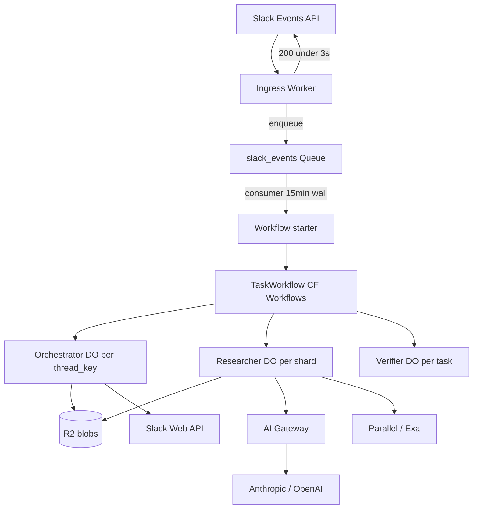

# Edge Actor Framework — Architecture & Gap Resolutions

> **Branch:** [`edge/cloudflare`](https://github.com/wcordelo/centaur/tree/edge/cloudflare) · **PR:** [#11](https://github.com/wcordelo/centaur/pull/11)  
> **Spec:** [Centaur-to-Edge Migration Spec](https://app.notion.com/p/Centaur-to-Edge-Migration-Spec-38d34448009481f58864e58be2a71c97)

Centaur-less serverless actor framework on **Cloudflare Workers**, **Durable Objects**, **Queues**, **Workflows**, and **per-DO SQLite**. K8s/Rust Centaur remains on `main` until cutover.

---

## Resolved decisions (all gaps closed)

| # | Decision |
|---|----------|
| D1 | **Hybrid orchestration:** [Cloudflare Workflows](https://developers.cloudflare.com/workflows/) for task DAG; **Researcher/Verifier DOs** for hot mutable state (not pure custom Fiber engine, not @cloudflare/agents SDK) |
| D2 | **TS-first** orchestration + tools Phases 1–4; **Wasm/Nix Phase 1b** for citation/dedup parsers (spec-aligned, non-blocking) |
| D3 | **One Orchestrator DO per `thread_key`**; **one Researcher DO per `task_id`** (shard); **Verifier DO per `task_id`** |
| D4 | **Slack ingress:** Queue → consumer → Orchestrator enqueue (<3s ack); never heavy `waitUntil` |
| D5 | **MVP Slack UX:** `chat.postMessage` + `assistant.threads.setStatus`; **MVP+:** `@centaur/rendering` subset streaming before org beta |
| D6 | **Company context:** MVP external-only; MVP+ R2 bundle; v1 D1 mirror from `main` ETL export |
| D7 | **No K8s session migration** — greenfield threads only; dual-run via separate Slack app |

---

## Architecture



### Actor roles

| Actor | ID | Responsibility |
|-------|-----|----------------|
| **Ingress Worker** | stateless | HMAC verify, `url_verification`, enqueue, admin routes |
| **TaskWorkflow** | CF Workflow | DAG: plan → shard → wait → merge → verify → revise loop → post |
| **Orchestrator DO** | `idFromName(thread_key)` | Thread tasks, Slack posts, permissions, render obligations |
| **Researcher DO** | `idFromName(task_id:shard_N)` | Fibers, tools, facts, outbox |
| **Verifier DO** | `idFromName(task_id)` | Pass/reject/revise; citation repair (TS port) |

**Verifier** is *logic-stateless* (verdict = f(objective, summary)); SQLite used only for idempotency cache.

### What “Centaur-less” means

- No api-rs, sandbox pods, iron-proxy, Postgres sessions, or Absurd on the edge path
- **Keeps:** thread key shape, websearch semantics, rendering patterns, Quick/R2, research UX goals
- **Defers to `main`:** general agent, 60+ tools, ETL, iron-control (hybrid paths documented)

---

## Ingress (Slack)

### Flow

1. Worker verifies `X-Slack-Signature` (reject if timestamp >5min skew)
2. Handle `url_verification` challenge inline
3. Dedup `event_id` via Queue message idempotency + Orchestrator `processed_slack_events`
4. `queue.send(event)` → return `200` immediately
5. Queue consumer calls `Orchestrator.enqueue(slackEvent)` (<500ms target)
6. Orchestrator starts **TaskWorkflow** via `env.TASK_WORKFLOW.create()`

### Required bot scopes

`app_mentions:read`, `chat:write`, `channels:history`, `groups:history`, `im:history`, `mpim:history`, `users:read`, `assistant:write`

### Thread / task model

- **Orchestrator DO** = one per `thread_key` (`slack:T:C:ts`)
- Each `@mention` creates **`task_id`** (uuid v7)
- Newer `event_ts` on same thread while `running` → mark prior `superseded`
- Thread **reply without @bot** within 5min of last activity → append to active task
- **`/centaur-stop`** slash command → `cancel` active task
- **`deadline_at`:** 30min default (env `EDGE_TASK_DEADLINE_MS`)

### Slack UX phases

| Phase | Delivery |
|-------|----------|
| MVP | Progress + final `chat.postMessage`; 3900-char chunks; `assistant.threads.setStatus` |
| MVP+ | `packages/edge-rendering` (Worker-safe `@centaur/rendering` subset); stream via Chat SDK adapter |
| v1 | `render_obligations` + recovery alarm (port from slackbotv2) |

### Dual-run / cutover

- **Beta:** separate Slack app “Centaur Edge” → CF Worker URL
- **Prod:** flip Request URL once; rollback = revert URL to K8s tunnel
- No shared session state between stacks

---

## TaskWorkflow (Cloudflare Workflows)

Replaces custom Orchestrator-only Fiber engine for **cross-actor DAG**:

```typescript
// Pseudocode — contrib/edge/worker/src/workflows/task-workflow.ts
export class TaskWorkflow extends WorkflowEntrypoint {
  async run(event: WorkflowEvent<TaskInput>, step: WorkflowStep) {
    const plan = await step.do('plan', () => llmPlanner(event.payload.objective));
    const shards = await step.do('shard', () => plan.subtasks.slice(0, 3));

    const shardResults = await Promise.all(
      shards.map((sub, i) =>
        step.do(`research-${i}`, () =>
          env.RESEARCHER.get(`${event.payload.task_id}:shard_${i}`).startTask({
            objective: sub,
            thread_context: event.payload.thread_context,
            request_id: `${event.payload.task_id}:${i}`,
          })
        )
      )
    );

    await step.do('wait-research', () => waitForOutboxComplete(event.payload.task_id));

    const merged = await step.do('merge', () => mergeShards(shardResults));

    let round = 0;
    let verdict = await step.do('verify', () => verify(merged, event.payload.objective));
    while (verdict.status === 'revise' && round < 3) {
      round++;
      await step.do(`revise-${round}`, () => reviseResearch(verdict.brief));
      verdict = await step.do(`reverify-${round}`, () => verify(merged, event.payload.objective));
    }

    await step.do('post-slack', () => postFinal(verdict, merged));
  }
}
```

**Partial shard failure:** if <2 of 3 shards complete → post partial report with disclaimer.

**Poison events:** after 3 workflow failures → `dead_letter` table + admin replay route.

---

## Researcher DO — Fibers

### Scheduler

- **One `alarm_queue` table** per DO; **one `setAlarm`** scheduling next due item
- Priority: `fiber_step` > `outbox_retry` > `external_poll` > `prune`
- Alarm handler: 15min wall; `limits.cpu_ms: 300000` (5min CPU)
- Never `setAlarm` in constructor without `getAlarm()` check

### Fiber step budget

| Limit | Value |
|-------|-------|
| Tool calls / step | 1 |
| LLM calls / step | 1 |
| Subrequests / step | ≤10 (wrangler `limits.max_subrequests` raised to 200) |
| CPU-heavy work / step | ≤20s |

### Tool schema (LLM function calling)

```typescript
const tools = [
  { name: 'search_web', params: { query: string, limit?: number } },
  { name: 'fetch_url', params: { url: string } },  // SSRF-checked
  { name: 'deep_research', params: { question: string } },  // external_job poll
];
```

### External jobs (Parallel deep_research)

- Fiber writes `{ kind: 'external_job', provider, job_id }` to `session_state`
- `alarm_queue` schedules `external_poll` with exponential backoff (cap 120s)
- Poll until terminal; store report in R2 if >1MB

### Context

- **Thread context:** Orchestrator fetches `conversations.replies` → R2 `thread_context/{task_id}.json`
- **Compaction:** every 5 Fiber steps, summarize log → `working_summary`; trim hot context at 80k estimated tokens

### Outbox → Orchestrator

At-least-once: write outbox row in same txn as log; Researcher RPCs Orchestrator.notify; retry via `alarm_queue`.

---

## Verifier DO

**Input RPC:** `{ objective, summary, citations[], fact_hashes[], request_id }` (<512KB)

**Output:** `{ verdict: 'pass'|'reject'|'revise', issues[], revision_brief?, request_id }`

**Citation repair (TS port from websearch):** reviewer → writer → repair (~3 modules, ~400 LOC)

**Revise loop:** max 3 rounds (Workflow-owned)

---

## Merge & knowledge graph

```sql
-- Researcher DO
CREATE TABLE verified_facts (...);
CREATE TABLE fact_edges (
  from_hash TEXT, to_hash TEXT, relation TEXT,  -- supports|contradicts|cites
  PRIMARY KEY (from_hash, to_hash, relation)
);
```

**mergeShards():**

1. Union facts; dedupe by `fact_hash`
2. Detect `contradicts` edges → Verifier adjudication RPC
3. LLM synthesis → final summary + citations

---

## Storage

### R2 spill

Payloads >256KB → R2 `blobs/{task_id}/{log_id}`; SQLite stores pointer in `blob_storage`.

### Retention

- `processed_requests` / `processed_slack_events`: 7-day TTL
- Tasks: 90-day retention alarm
- `deleteThread(thread_key)` admin route: purge DOs + R2 prefix (GDPR)

### Schema migration

- `schema_version` + `code_version` in `session_state`
- `blockConcurrencyWhile(() => migrateSchema())` on boot
- SQL files in `contrib/edge/worker/migrations/`

---

## Security

| Threat | Mitigation |
|--------|------------|
| SSRF | Block RFC1918, link-local, metadata IPs; HTTPS only; no redirects to private |
| Prompt injection | Slack body in `<untrusted>` block; system prompt instructs ignore |
| Secret leakage | Redact `Authorization` in logs; secrets only in Worker env |
| Scraping ToS | Respect robots.txt; disclaimer in footer when scraping |
| Parallel free tier | Append required attribution string to user-visible output |

---

## Permissions

| Phase | Model |
|-------|-------|
| MVP | `SLACK_ALLOWED_CHANNEL_IDS` + `SLACK_ALLOWED_USER_IDS` (optional) env allowlists |
| v1 | D1 `principals` table synced from centaur-perms export (batch job on `main`) |

---

## Company context (hybrid)

| Phase | Source |
|-------|--------|
| MVP | External (Parallel/web) only |
| MVP+ | Manual R2 bundle `context/{workspace_id}/*.md` |
| v1 | Nightly export from `main` Postgres `company_context_documents` → D1 read replica |
| v2 | Vectorize index; query from Researcher via `search_internal` tool |

Org deployment **requires v1 minimum** — documented product gate.

---

## LLM routing

1. **AI Gateway** primary (`cf-aig-metadata` for cost attribution)
2. Circuit breaker on 5xx → direct provider fetch (`LLM_DIRECT_FALLBACK=1`)
3. Orchestrator tracks model error rates → fallback hint (`claude-sonnet-4` → `gpt-4o`)

**Mock for CI:** `LLM_MODE=mock` → `MockLlmAdapter` returns fixture summaries

---

## Observability & ops

### Structured logs (every line)

```json
{ "service": "centaur-edge", "thread_key", "task_id", "actor", "fiber_index", "request_id", "event" }
```

### SLOs (MVP)

| Metric | Target |
|--------|--------|
| Slack ack | p99 <2s |
| First progress post | <30s from mention |
| Task complete | p95 <15min (simple), <45min (deep_research) |

### Environments

| Env | Worker name |
|-----|-------------|
| staging | `centaur-edge-staging` |
| production | `centaur-edge-prod` |
| PR preview | `centaur-edge-pr-$NUMBER` |

### Cost guardrails (`task_budget`)

```typescript
{ max_alarms: 200, max_llm_calls: 50, max_tool_calls: 30, max_parallel_jobs: 2 }
```

Per-channel daily cap: `EDGE_CHANNEL_DAILY_TASK_CAP` (default 100)

### Feature flags

KV `EDGE_FLAGS`: `{ streaming_enabled, internal_context_enabled, browser_fetch_enabled }`

### Admin

- `GET /admin/tasks/:task_id` — Cloudflare Access gated
- `POST /admin/tasks/:task_id/replay` — dead letter replay
- Nightly audit export: `audit_log` → R2

---

## Testing

| Suite | Purpose |
|-------|---------|
| Vitest + Miniflare | Unit + DO SQLite |
| `test/chaos/` | Evict DO mid-Fiber; alarm resume |
| `test/contracts/` | Zod RPC schemas Orchestrator ↔ Researcher ↔ Verifier |
| `test/slack-emulate/` | Port patterns from slackbotv2 emulate tests |
| `LLM_MODE=mock` | CI without API keys |
| Load | 50 concurrent thread_keys; document DO billing |

---

## Monorepo integration

```json
// contrib/edge/package.json
{
  "name": "centaur-edge",
  "dependencies": {
    "@centaur/rendering": "workspace:*",
    "@centaur/harness-events": "workspace:*"
  }
}
```

If Worker bundler incompatible → `packages/edge-rendering` thin fork.

---

## Explicit non-goals

- General codex/claude/amp agent harness
- 60+ tool plugins (only search/fetch/deep_research MVP)
- Teams, Discord, Linear ingress (v2 `IngressAdapter` interface reserved)
- K8s sandbox / browser automation MVP (v1: Browser Rendering API optional)
- Session migration K8s ↔ edge
- iron-control runtime (batch export only v1)

---

## Implementation phases

| Phase | Weeks | Deliverables |
|-------|-------|--------------|
| 1 | 1–2 | Wrangler (Queue, Workflow, 3 DOs, R2), adapters, mock LLM, CI |
| 2 | 3–4 | TaskWorkflow, RPC contracts, alarm_queue, outbox |
| 3 | 5–6 | Slack module, permissions, thread context |
| 4 | 7–9 | Research E2E, verifier revise, merge, cost caps |
| 1b | post-4 | Wasm/Nix parsers |
| 5 | cutover | Second Slack app beta → prod flip, runbook |

---

## wrangler bindings (target)

```jsonc
{
  "name": "centaur-edge",
  "main": "worker/src/index.ts",
  "compatibility_date": "2026-04-01",
  "limits": { "cpu_ms": 300000 },
  "queues": {
    "producers": [{ "binding": "SLACK_EVENTS", "queue": "centaur-slack-events" }],
    "consumers": [{ "queue": "centaur-slack-events", "max_batch_size": 1 }]
  },
  "workflows": [{ "binding": "TASK_WORKFLOW", "class_name": "TaskWorkflow" }],
  "durable_objects": {
    "bindings": [
      { "name": "ORCHESTRATOR", "class_name": "Orchestrator" },
      { "name": "RESEARCHER", "class_name": "Researcher" },
      { "name": "VERIFIER", "class_name": "Verifier" }
    ]
  },
  "r2_buckets": [{ "binding": "BLOBS", "bucket_name": "centaur-edge-blobs" }],
  "kv_namespaces": [{ "binding": "EDGE_FLAGS", "id": "<staging-id>" }],
  "d1_databases": [{ "binding": "PRINCIPALS", "database_name": "centaur-edge-principals", "database_id": "<v1>" }]
}
```

---

## Gap traceability (G1–G40)

All adversarial review items from plan passes 1–3 are closed. Mapping:

| ID | Resolution (section) |
|----|----------------------|
| G1 | Researcher Fibers via `alarm()`; `cpu_ms: 300000`; Orchestrator never blocks on full research (TaskWorkflow + outbox) |
| G2 | Verifier RPC bounded summary JSON; R2 for large artifacts (Verifier DO) |
| G3 | R2 spill >256KB; `blob_storage` table; log pruning (Storage) |
| G4 | Full `slack/` module spec: signing, dedup, obligations (Ingress) |
| G5 | Async completion: Queue → Workflow → outbox notify (TaskWorkflow diagram) |
| G6 | MVP allowlists; v1 D1 principals (Permissions) |
| G7 | Structured logs, AI Gateway metadata, admin export (Observability) |
| G8 | TS-first Phases 1–4; Wasm Phase 1b (Resolved D2) |
| G9 | Single-flight per thread; `event_id` dedup (Thread / task model) |
| G10 | 7-day TTL prune; R2 archive (Storage / Retention) |
| G11 | `external_job` Fiber + poll alarm (External jobs) |
| G12 | Alarms sufficient MVP; hibernation deferred unless streaming WS |
| G13 | `.github/workflows/edge.yml` in Phase 1 CI |
| G14 | Dual Slack app beta; rollback = URL flip (Dual-run) |
| G15 | Explicit non-goals + MVP scope table (Explicit non-goals) |
| G16 | Queue ingress; no heavy `waitUntil` (Ingress flow) |
| G17 | Phased Slack UX MVP → MVP+ → v1 (Slack UX phases) |
| G18 | `conversations.replies` → R2 thread context (Context) |
| G19 | `alarm_queue` single `setAlarm` (Researcher scheduler) |
| G20 | ≤10 subrequests per Fiber step (Fiber step budget) |
| G21 | Verifier revise loop max 3 rounds (TaskWorkflow) |
| G22 | Supersede by `event_ts`; `/centaur-stop` (Thread / task model) |
| G23 | `deadline_at` 30min default (Thread / task model) |
| G24 | `fact_edges` knowledge graph (Merge & knowledge graph) |
| G25 | Company context hybrid path; org gate at v1 (Company context) |
| G26 | SSRF, injection, redaction, Parallel attribution (Security) |
| G27 | No headless browser MVP; Browser Rendering API v1 optional |
| G28 | `mergeShards()` + partial quorum (TaskWorkflow) |
| G29 | `code_version` in `session_state`; migration on boot |
| G30 | `schema_version` + SQL migrations folder |
| G31 | staging/prod/preview env names (Environments) |
| G32 | Vitest, chaos, contracts, emulate, mock LLM (Testing) |
| G33 | Compaction every 5 Fiber steps (Context) |
| G34 | `deleteThread()` admin route; 90-day retention (Retention) |
| G35 | Separate “Centaur Edge” Slack app (Dual-run) |
| G36 | Hybrid CF Workflows + DO actors (Resolved D1) |
| G37 | `task_budget` + channel daily cap (Cost guardrails) |
| G38 | `@centaur/rendering` or `packages/edge-rendering` fork (Monorepo) |
| G39 | `IngressAdapter` interface reserved; Slack only MVP |
| G40 | AI Gateway + direct fallback + error-rate hint (LLM routing) |

Category inventory (A1–I): see plan consolidated table — all rows point to sections above or Resolved D1–D7.

